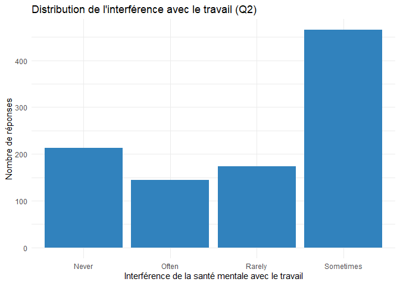
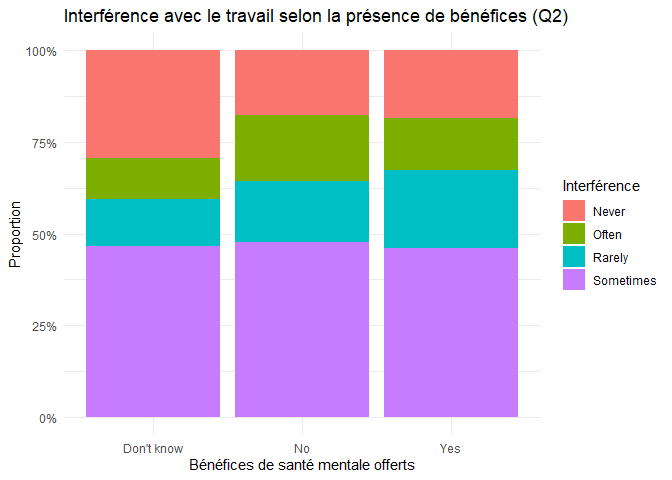

Devoir 05 - Santé mentale dans le secteur technologique
================
Robinson Cacquevel
22/10/2025

### Section 1 — Introduction

Nous utilisons les données du sondage **“Mental Health in Tech Survey”**
(Kaggle) pour étudier la santé mentale de personnes travaillant dans le
secteur technologique.  
Le jeu de données contient environ **1 259 observations** et **27
variables** issues d’un questionnaire en ligne.

Nous nous concentrons sur deux questions de recherche :

1.  **Q1 – Accès au traitement :** quels facteurs personnels et
    professionnels sont associés au fait d’avoir déjà reçu un
    **traitement** pour un problème de santé mentale (`treatment`,
    Yes/No) ?
2.  **Q2 – Interférence avec le travail :** dans quelle mesure la santé
    mentale **interfère avec le travail** (`work_interfere`) et comment
    ce niveau d’interférence est-il lié aux **politiques et au climat de
    l’entreprise** (bénéfices, options de soins, anonymat, etc.) ?

Les variables incluent notamment :  
- des variables **catégorielles** (`gender`, `country`, `self_employed`,
`family_history`, `work_interfere`, `treatment`, `benefits`,
`care_options`, etc.),  
- des variables **numériques discrètes** (`age`, `no_employees`).

------------------------------------------------------------------------

### Section 2 — Données

Dans cette section, nous décrivons le jeu de données et montrons un
premier aperçu des variables utilisées dans le projet.

``` r
library(tidyverse)
library(janitor)
library(skimr)

# Chargement des données nettoyées (créées via script/01_load_glimpse.R)
# On remonte d'un dossier car ce fichier est dans /proposition
df <- readRDS("../data/mental_health.rds")

# Nettoyage des noms de colonnes au cas où
df <- df %>% clean_names()
```

### Section 3 — Plan d’analyse des données

#### 3.1 Variables de résultat (Y) et prédictives (X)

- **Q1 – Accès au traitement**
  - Variable réponse (Y) : `treatment` (a déjà reçu un traitement : Yes
    / No).  
  - Variables explicatives (X) principales :
    - `family_history` (antécédents familiaux : Yes / No),  
    - `age` (âge, que l’on pourra regrouper en classes),  
    - `gender`,  
    - `no_employees` (taille de l’entreprise),  
    - `self_employed` (travailleur·euse autonome ou non).
- **Q2 – Interférence avec le travail**
  - Variable réponse (Y) : `work_interfere` (Never / Rarely / Sometimes
    / Often).  
  - Variables explicatives (X) principales :
    - `benefits` (bénéfices de santé mentale offerts ou non),  
    - `care_options` (options de soins connues / accessibles),  
    - `anonymity` (perception de l’anonymat),  
    - `no_employees` (taille de l’entreprise).

#### 3.2 Groupes de comparaison

- Pour Q1 : comparer la proportion de personnes ayant reçu un traitement
  - avec vs sans **antécédents familiaux** (`family_history`),  
  - selon quelques grandes classes d’**âge**,  
  - selon la **taille de l’entreprise** (`no_employees`).
- Pour Q2 : comparer la distribution de `work_interfere`
  - entre les entreprises avec vs sans **bénéfices** de santé mentale
    (`benefits`),  
  - selon la taille de l’entreprise.

#### 3.3 Analyse exploratoire très préliminaire

Dans la proposition, l’analyse sera **très simple** :

- Calculer quelques **tableaux de fréquences** et **proportions** (par
  ex. `treatment` par `family_history`, `work_interfere` globalement).  
- Faire **1–2 graphiques de barres** :
  - proportion de traitement selon les antécédents familiaux,  
  - distribution de `work_interfere`, éventuellement selon `benefits`.

Ces premiers résultats serviront uniquement à :

- vérifier qu’il y a assez d’observations dans chaque catégorie,  
- se faire une idée des tendances générales (ex. : plus de traitement
  quand il y a des antécédents familiaux, plus d’interférence dans
  certains contextes d’entreprise).

``` r
# Tableau de fréquences et proportions pour work_interfere (Q2)
df |> 
    count(work_interfere) |>
    mutate(prop = n / sum(n))
```

    ## # A tibble: 5 × 3
    ##   work_interfere     n  prop
    ##   <chr>          <int> <dbl>
    ## 1 Never            213 0.169
    ## 2 Often            144 0.114
    ## 3 Rarely           173 0.137
    ## 4 Sometimes        465 0.369
    ## 5 <NA>             264 0.210

``` r
# Graphique simple : distribution de work_interfere
df |>
    filter(!is.na(work_interfere)) |>
    ggplot(aes(x = work_interfere)) +
    geom_bar(fill = "#3182bd") +
    labs(
        x = "Interférence de la santé mentale avec le travail",
        y = "Nombre de réponses",
        title = "Distribution de l'interférence avec le travail (Q2)"
    ) +
    theme_minimal()
```

<!-- -->

``` r
# Graphique préliminaire : work_interfere selon la présence de bénéfices
df |>
    filter(!is.na(work_interfere), !is.na(benefits)) |>
    ggplot(aes(x = benefits, fill = work_interfere)) +
    geom_bar(position = "fill") +
    scale_y_continuous(labels = scales::percent_format(accuracy = 1)) +
    labs(
        x = "Bénéfices de santé mentale offerts",
        y = "Proportion",
        fill = "Interférence",
        title = "Interférence avec le travail selon la présence de bénéfices (Q2)"
    ) +
    theme_minimal()
```

<!-- -->

#### 3.4 Méthodes envisagées

Pour le projet final (pas forcément tout dans la proposition) :

- **Statistiques descriptives** : fréquences, proportions, résumés
  numériques, graphiques de barres.  
- **Comparaisons de proportions** pour Q1 (par ex. comparer la
  proportion de `treatment = Yes` selon `family_history` ou selon des
  groupes d’âge).  
- Possiblement un modèle simple (par ex. **régression logistique** pour
  `treatment` ou **modèle ordinal** pour `work_interfere`) si le temps
  le permet.

#### 3.5 Résultats attendus de ces méthodes

Les résultats dont nous aurons besoin pour répondre aux questions :

- Pour Q1 :
  - Différences de **proportions** de traitement entre les groupes (par
    ex. avec / sans antécédents familiaux).  
  - Graphiques clairs qui montrent ces différences.
- Pour Q2 :
  - Répartition des niveaux de `work_interfere` dans différents
    contextes d’entreprise (avec / sans bénéfices, taille
    d’entreprise).  
  - Graphiques permettant de voir si certains contextes sont associés à
    plus d’interférence.

L’objectif est d’avoir quelques **résumés numériques simples** et **2–3
visualisations lisibles** qui aident à répondre de façon qualitative aux
deux questions de recherche.
